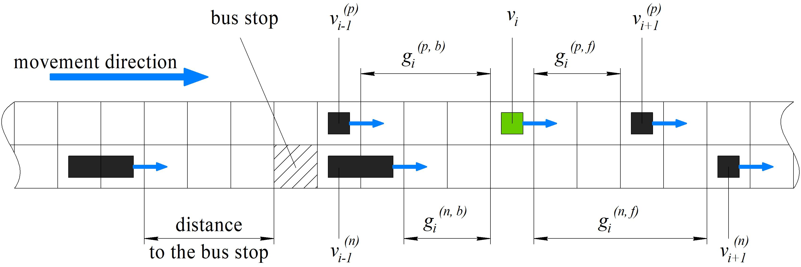
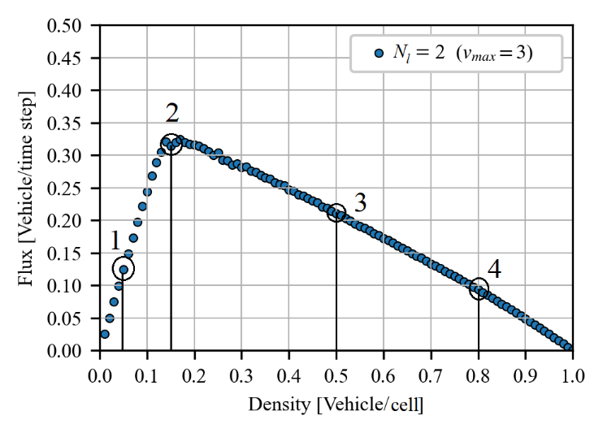

# TrafficModel

__
## Describe 
This is the module for traffic flow modeling.

The Nagel–Schreckenberg (NaSch) model base on cellular automata.

The road is multilanes and circle (periodic boundary condition)

The model support two type of vehicles:

* `private vehicle` (1 cell lenght)
* `bus` (2 cells lenght)

Buses stop on stations

The typology of model:

## Example

The fundemaential diagramm for `private vechile`:

